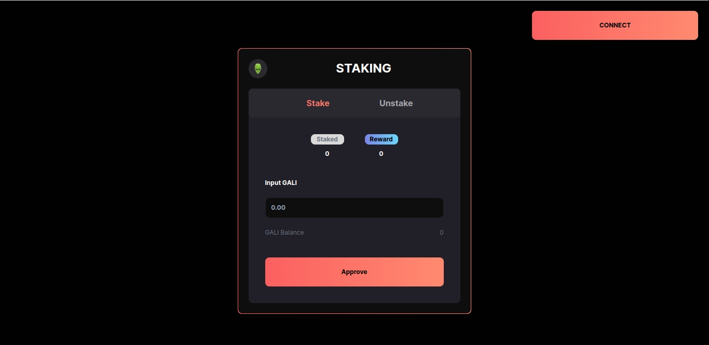

  <a href="#-tecnologias">Tecnologias</a>&nbsp;&nbsp;&nbsp;|&nbsp;&nbsp;&nbsp;
  <a href="#-projeto">Projeto</a>&nbsp;&nbsp;&nbsp;|&nbsp;&nbsp;&nbsp;
  <a href="#memo-licença">Licença</a>

 

  

## 🚀 Tecnologias

Esse projeto foi desenvolvido com as seguintes tecnologias:

- Nextjs
- Tailwind
- Typescript
- Solidity

## 💻 Projeto

Gali staking é um projeto desenvolvido para um game nft, consiste em duas telas, uma onde o usuário deposita seus tokens e após o tempo determinado pelo deployer do contrato, ele pode sacar com uma porecentagem de lucro também determinada pelo deployer.

## 📝 Licença

Esse projeto está sob a licença MIT. Veja o arquivo [LICENSE](LICENSE) para mais detalhes.
